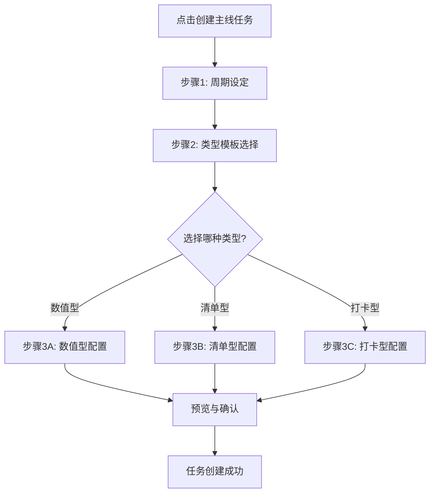
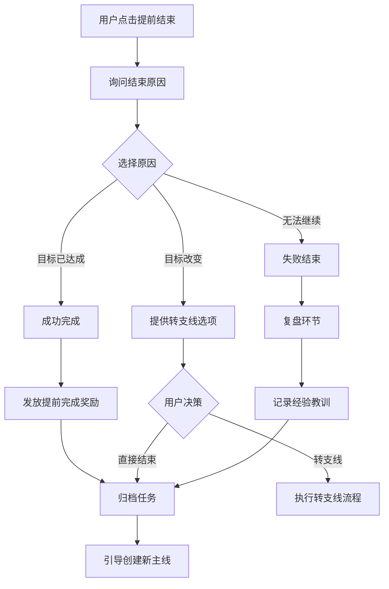
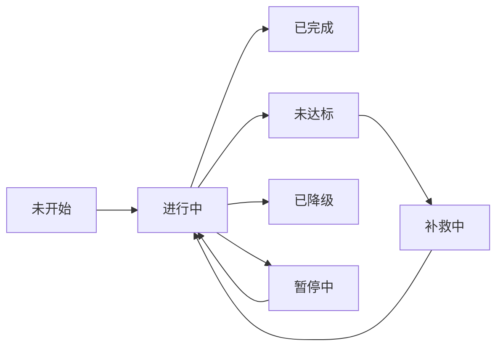

## 1. 产品设计概述

### 1.1 核心定位

**主线任务（Main Quest）是用户在当前周期内唯一且最重要的目标。**它是整个"36×10"体系的锚点，通过三种任务类型（数值型、清单型、打卡型）适配不同的目标场景，解决用户目标过多导致注意力分散的问题。

### 1.2 核心价值

- **聚焦效应**：强制同一时间只能存在一个主线，确保精力集中在最关键的事务上。

- **高频反馈**：基于短周期快速验证目标可行性，避免长期目标的拖延感。

- **类型匹配**：根据目标性质选择合适的任务类型，提供差异化的打卡体验。

- **智能提醒**：根据周期进度和完成情况，动态调整提醒策略。

### 1.3 设计原则

1. **类型导向**：创建时先选类型，再填内容，降低决策成本。

2. **极简输入**：每种类型的创建流程不超过3步。

3. **强视觉提示**：不同类型在UI上有明显的视觉区分。

4. **严格约束**：严格执行"唯一性"和"周期性"规则，不妥协。

---

## 2. 三种任务类型定义

### 2.1 类型对比表

| 维度 | 数值类型 | 清单类型 | 打卡类型 |
| --- | --- | --- | --- |
| **核心目标** | 达到某个具体数值 | 完成一系列事项 | 养成持续习惯 |
| **适用场景** | 减重、存钱、阅读页数 | 完成书单、项目清单 | 背单词、健身、冥想 |
| **打卡方式** | 记录数值变化 | 标记清单项完成 | 记录打卡次数 |
| **进度计算** | (当前值-起始值)/(目标值-起始值) | 已完成项/总项数 | 已打卡天数/目标天数 |
| **松散度** | 高（可多日不打卡） | 中（需按清单推进） | 低（强调每日连续） |
| **周期目标** | 阶段性数值（如每周期1斤） | 阶段性事项（如每周期1本书） | 阶段性次数（如每周期7次） |

### 2.2 类型特性详解

#### 类型A：数值型任务

**核心特征：**

- 目标是从起点数值到达终点数值（可增可减）

- 支持正向增长（如存钱）和负向减少（如减重）

- 每次打卡记录最新数值，系统自动计算增量

- 松散型完成机制，允许多日不打卡

**典型案例：**

- 减重：从150斤减到140斤

- 存钱：从0元存到10000元

- 阅读：从0页读到3000页

#### 类型B：清单型任务

**核心特征：**

- 目标是完成一个预设的清单列表

- 每个清单项可以独立标记完成

- 支持将清单项转为支线任务并关联主线

- 每日打卡更新整体进度，记录大事件完成

**典型案例：**

- 读书计划：完成10本历史书

- 技能树：掌握5项编程技能

- 旅行清单：打卡10个城市

#### 类型C：打卡型任务

**核心特征：**

- 目标是养成持续性的每日习惯

- 每日打卡记录一次完成行为

- 强调连续性和频次累积

- 适合高频重复的小颗粒行为

**典型案例：**

- 背单词：每天背20个单词

- 运动打卡：每天健身30分钟

- 冥想习惯：每天冥想10分钟

---

## 3. 创建流程设计

### 3.1 流程图



### 3.2 步骤1：周期设定界面

```plaintext
┌─────────────────────────────────┐
│         创建主线任务            │
├─────────────────────────────────┤
│                                 │
│  📅 设定总时长                  │
│                                 │
│  ┌───────────────────────────┐ │
│  │ 我想用多久完成这个目标？  │ │
│  └───────────────────────────┘ │
│                                 │
│  [  1个月  ] [  3个月  ] 📍    │
│  [  半年   ] [  1年    ]        │
│                                 │
│  自定义: [ ___ ] 天             │
│                                 │
│  ⏰ 选择周期长度                │
│                                 │
│  ○ 10天一个周期（适合短期冲刺）│
│  ● 30天一个周期（适合月度计划）│
│  ○ 自定义 [ ___ ] 天            │
│                                 │
│  ℹ️ 预计将创建 10 个周期         │
│                                 │
│         [ 下一步 ]              │
└─────────────────────────────────┘
```

**交互逻辑：**

1. 用户可快速选择预设时长（1个月/3个月/半年/1年）

2. 也可以自定义总天数

3. 根据总时长和周期长度，自动计算周期数

4. 系统推荐：<3个月用10天周期，≥3个月用30天周期

### 3.3 步骤2：类型模板选择界面

```plaintext
┌─────────────────────────────────┐
│       选择任务类型模板          │
├─────────────────────────────────┤
│                                 │
│  ┌─────────────────────────┐   │
│  │  📈 数值型任务          │   │
│  │  ─────────────────────  │   │
│  │  适合有明确数值目标      │   │
│  │  例如：减重、存钱、阅读  │   │
│  │                         │   │
│  │  特点：松散打卡，记录数值│   │
│  └─────────────────────────┘   │
│                                 │
│  ┌─────────────────────────┐   │
│  │  📋 清单型任务          │   │
│  │  ─────────────────────  │   │
│  │  适合完成一系列事项      │   │
│  │  例如：读书计划、技能树  │   │
│  │                         │   │
│  │  特点：清单管理，逐项完成│   │
│  └─────────────────────────┘   │
│                                 │
│  ┌─────────────────────────┐   │
│  │  ✅ 打卡型任务          │   │
│  │  ─────────────────────  │   │
│  │  适合养成每日习惯        │   │
│  │  例如：背单词、运动打卡  │   │
│  │                         │   │
│  │  特点：每日打卡，强调连续│   │
│  └─────────────────────────┘   │
│                                 │
│    [ 上一步 ]      [ 下一步 ]   │
└─────────────────────────────────┘
```

**交互逻辑：**

1. 三种类型用卡片形式展示，点击选中

2. 每种类型下方有简短说明和典型案例

3. 选中后卡片高亮，显示"已选中"标识

### 3.4 步骤3A：数值型配置界面

```plaintext
┌─────────────────────────────────┐
│       数值型任务设定            │
├─────────────────────────────────┤
│                                 │
│  📝 任务名称                    │
│  ┌───────────────────────────┐ │
│  │ 减重到理想体重            │ │
│  └───────────────────────────┘ │
│                                 │
│  🎯 数值目标                    │
│                                 │
│  起始值: [ 150 ] 斤             │
│  目标值: [ 140 ] 斤             │
│                                 │
│  增减方向: ○ 增加  ● 减少       │
│                                 │
│  📊 系统自动规划                │
│  ─────────────────────────      │
│  总时长: 3个月 (90天)           │
│  周期数: 9个周期                │
│  总目标: 减少 10斤              │
│                                 │
│  每周期目标: 1.11 斤/周期       │
│  每日平均: 0.11 斤/天           │
│                                 │
│  ⚙️ 高级设置（可选）             │
│  [▼] 展开                       │
│                                 │
│      [ 上一步 ]   [ 创建任务 ]  │
└─────────────────────────────────┘
```

**高级设置展开：**

```plaintext
│  ⚙️ 高级设置                     │
│  ┌───────────────────────────┐ │
│  │ 打卡提醒策略              │ │
│  │ ● 智能提醒（推荐）        │ │
│  │   - 周期过半进度<50%:     │ │
│  │     隔天提醒              │ │
│  │   - 周期临近进度<80%:     │ │
│  │     每日急促提醒          │ │
│  │                           │ │
│  │ ○ 每日固定提醒            │ │
│  │ ○ 不设提醒                │ │
│  └───────────────────────────┘ │
```

**交互逻辑：**

1. 输入起始值和目标值后，自动计算总变化量

2. 根据之前设定的周期数，自动计算每周期目标和每日平均

3. 用户可以在高级设置中调整提醒策略

4. 点击"创建任务"前显示完整预览

### 3.5 步骤3B：清单型配置界面

```plaintext
┌─────────────────────────────────┐
│       清单型任务设定            │
├─────────────────────────────────┤
│                                 │
│  📝 任务名称                    │
│  ┌───────────────────────────┐ │
│  │ 完成10本历史书阅读        │ │
│  └───────────────────────────┘ │
│                                 │
│  📋 清单设定                    │
│                                 │
│  总项数: [ 10 ] 项              │
│                                 │
│  ┌───────────────────────────┐ │
│  │ 快速创建清单项：          │ │
│  │                           │ │
│  │ [+] 1. 《史记》           │ │
│  │ [+] 2. 《资治通鉴》       │ │
│  │ [+] 3. ___________        │ │
│  │ [+] 4. ___________        │ │
│  │                           │ │
│  │ [ + 添加更多清单项 ]      │ │
│  └───────────────────────────┘ │
│                                 │
│  ℹ️ 创建后可在详情页继续编辑    │
│                                 │
│  📊 系统自动规划                │
│  ─────────────────────────      │
│  总时长: 1年 (360天)            │
│  周期数: 12个周期 (30天/周期)  │
│  总项数: 10项                   │
│                                 │
│  每周期目标: 1项/周期           │
│                                 │
│      [ 上一步 ]   [ 创建任务 ]  │
└─────────────────────────────────┘
```

**交互逻辑：**

1. 用户输入总项数后，显示对应数量的输入框

2. 可以快速填写清单项名称，也可以创建后再编辑

3. 系统自动计算每周期需要完成的项数（向上取整）

4. 支持"+ 添加更多清单项"按钮动态增加

### 3.6 步骤3C：打卡型配置界面

```plaintext
┌─────────────────────────────────┐
│       打卡型任务设定            │
├─────────────────────────────────┤
│                                 │
│  📝 任务名称                    │
│  ┌───────────────────────────┐ │
│  │ 每天背20个单词            │ │
│  └───────────────────────────┘ │
│                                 │
│  ✅ 打卡规则                    │
│                                 │
│  每日目标: [ 1 ] 次             │
│  （每天需要打卡的次数）         │
│                                 │
│  打卡单位:                      │
│  ● 次数（完成即可）             │
│  ○ 时长（需记录分钟数）         │
│  ○ 数量（需记录具体量）         │
│                                 │
│  📊 系统自动规划                │
│  ─────────────────────────      │
│  总时长: 1年 (360天)            │
│  周期数: 36个周期 (10天/周期)  │
│                                 │
│  每周期目标: 10次打卡           │
│  预计总打卡: 360次              │
│                                 │
│  ⚙️ 高级设置（可选）             │
│  ┌───────────────────────────┐ │
│  │ ☑ 允许每日多次打卡        │ │
│  │ ☑ 启用连续打卡激励        │ │
│  │ ☐ 周末豁免（周末不计入）  │ │
│  └───────────────────────────┘ │
│                                 │
│      [ 上一步 ]   [ 创建任务 ]  │
└─────────────────────────────────┘
```

**交互逻辑：**

1. 用户设定每日目标次数（通常为1次）

2. 选择打卡单位（次数/时长/数量）

3. 高级设置提供额外选项：

   - 允许多次打卡：适合高频行为（如喝水）

   - 连续打卡激励：达到7天/30天连续时给予奖励

   - 周末豁免：周末不计入打卡要求

---

## 4. 首页显示设计

### 4.1 数值型首页卡片

```plaintext
┌─────────────────────────────────┐
│  📌 主线任务                    │
│  ┌───────────────────────────┐ │
│  │ 📈 减重到理想体重         │ │
│  │                           │ │
│  │ 周期 5/9   ⏰ 还剩6天     │ │
│  │                           │ │
│  │ 本周期: 148.5斤 → 147斤   │ │
│  │ [▓▓▓▓▓▓▓░░░] 70%          │ │
│  │                           │ │
│  │ 总目标: 150斤 → 140斤     │ │
│  │ [▓▓▓▓▓░░░░░] 50%          │ │
│  │                           │ │
│  │         [ 记录数据 ]      │ │
│  └───────────────────────────┘ │
└─────────────────────────────────┘
```

**设计要点：**

- 双进度条：上方显示本周期进度，下方显示总目标进度

- 数值区间：用箭头表示起点→终点

- 操作按钮：底部"记录数据"按钮，点击后输入最新数值

### 4.2 清单型首页卡片

```plaintext
┌─────────────────────────────────┐
│  📌 主线任务                    │
│  ┌───────────────────────────┐ │
│  │ 📋 完成10本历史书阅读     │ │
│  │                           │ │
│  │ 周期 3/12  ⏰ 还剩12天    │ │
│  │                           │ │
│  │ 本周期进度                │ │
│  │ [▓▓▓▓▓▓▓▓░░] 1/1 📖      │ │
│  │                           │ │
│  │ 总进度: 3/10 本           │ │
│  │ [▓▓▓░░░░░░░] 30%          │ │
│  │                           │ │
│  │ 📝 当前TODO:              │ │
│  │ ┌───────────────────────┐│ │
│  │ │ ☐ 《全球通史》        ││ │
│  │ │   进度: 120/450页     ││ │
│  │ └───────────────────────┘│ │
│  │                           │ │
│  │      [ 更新进度 ]         │ │
│  └───────────────────────────┘ │
└─────────────────────────────────┘
```

**设计要点：**

- 双进度条：本周期完成情况 + 总进度

- TODO展示：显示当前正在进行的清单项

- 进度细节：清单项内部也可以有子进度（如页数）

- 操作按钮："更新进度"按钮，点击后可标记完成或更新子进度

### 4.3 打卡型首页卡片

```plaintext
┌─────────────────────────────────┐
│  📌 主线任务                    │
│  ┌───────────────────────────┐ │
│  │ ✅ 每天背20个单词         │ │
│  │                           │ │
│  │ 周期 18/36 ⏰ 还剩4天     │ │
│  │                           │ │
│  │ 本周期打卡                │ │
│  │ [▓▓▓▓▓▓░░░░] 6/10 次     │ │
│  │                           │ │
│  │ 总打卡: 173/360 次        │ │
│  │ [▓▓▓▓▓░░░░░] 48%          │ │
│  │                           │ │
│  │ 🔥 连续打卡: 12 天        │ │
│  │                           │ │
│  │      [ ✓ 今日打卡 ]       │ │
│  │      (已打卡显示对勾)     │ │
│  └───────────────────────────┘ │
└─────────────────────────────────┘
```

**设计要点：**

- 双进度条：本周期打卡次数 + 总打卡数

- 连续天数：显眼显示连续打卡天数，强化成就感

- 操作按钮：大号"今日打卡"按钮，已打卡则显示对勾状态

---

## 5. 详情页设计

### 5.1 数值型详情页

```plaintext
┌─────────────────────────────────┐
│ ✕               ✏️  ⋮          │
├─────────────────────────────────┤
│                                 │
│        📈 减重到理想体重        │
│                                 │
│          50%                    │
│  ━━━━━━━━━━━━━━━━━━━━━━━━      │
│  (紫蓝渐变进度条)               │
│                                 │
│  周期 5/9          6天剩余      │
│                                 │
├─────────────────────────────────┤
│  本周期   历史记录   数据图表   │
│  ━━━━━━                         │
├─────────────────────────────────┤
│                                 │
│  📊 本周期目标                  │
│  ┌───────────────────────────┐ │
│  │  148.5斤 → 147斤          │ │
│  │                           │ │
│  │  [▓▓▓▓▓▓▓░░░] 70%         │ │
│  │                           │ │
│  │  已减: 1.5斤              │ │
│  │  还需: 0.5斤              │ │
│  └───────────────────────────┘ │
│                                 │
│  ┌─────────────┬─────────────┐ │
│  │   148.5斤   │    70%      │ │
│  │  当前体重    │  周期完成率  │ │
│  └─────────────┴─────────────┘ │
│                                 │
│  📅 本周期: 12/10 - 12/19      │
│                                 │
│  [ 📝 记录新数据 ]             │
│  (黑色大按钮，全宽)             │
│                                 │
└─────────────────────────────────┘
```

**点击"记录新数据"弹窗：**

```plaintext
┌─────────────────────────────────┐
│         记录体重数据            │
├─────────────────────────────────┤
│                                 │
│  当前体重: [ 148.2 ] 斤         │
│                                 │
│  与上次对比: -0.3斤 ⬇️          │
│                                 │
│  📝 备注（可选）                │
│  ┌───────────────────────────┐ │
│  │ 今天控制饮食效果不错...   │ │
│  └───────────────────────────┘ │
│                                 │
│      [ 取消 ]      [ 确认记录 ] │
└─────────────────────────────────┘
```

**历史记录Tab：**

```plaintext
│  历史记录                       │
│  ━━━━━━                         │
├─────────────────────────────────┤
│                                 │
│  📈 增减历史                    │
│  ┌───────────────────────────┐ │
│  │ 12/15  148.2斤  -0.3⬇️   │ │
│  │        今天控制饮食效果...│ │
│  ├───────────────────────────┤ │
│  │ 12/13  148.5斤  -0.5⬇️   │ │
│  │        多走了一万步       │ │
│  ├───────────────────────────┤ │
│  │ 12/10  149.0斤  -1.0⬇️   │ │
│  │        (周期起始点)       │ │
│  └───────────────────────────┘ │
│                                 │
└─────────────────────────────────┘
```

### 5.2 清单型详情页

```plaintext
┌─────────────────────────────────┐
│ ✕               ✏️  ⋮          │
├─────────────────────────────────┤
│                                 │
│      📋 完成10本历史书阅读      │
│                                 │
│          30%                    │
│  ━━━━━━━━━━━━━━━━━━━━━━━━      │
│                                 │
│  周期 3/12        12天剩余      │
│                                 │
├─────────────────────────────────┤
│  当前清单   已完成   全部清单   │
│  ━━━━━━                         │
├─────────────────────────────────┤
│                                 │
│  📚 本周期清单 (1/1)            │
│                                 │
│  ┌───────────────────────────┐ │
│  │ ☑ 《史记》               │ │
│  │   进度: 450/450页 ✅      │ │
│  │   完成时间: 12/08         │ │
│  │   [ 转为支线 ]            │ │
│  └───────────────────────────┘ │
│                                 │
│  下周期预计清单                 │
│  ┌───────────────────────────┐ │
│  │ ☐ 《全球通史》           │ │
│  │   进度: 0/680页           │ │
│  │   [ 提前开始 ]            │ │
│  └───────────────────────────┘ │
│                                 │
│  📅 本周期: 12/01 - 12/30      │
│                                 │
│  [ 📝 更新进度 ]               │
│                                 │
└─────────────────────────────────┘
```

**点击清单项展开详情：**

```plaintext
┌─────────────────────────────────┐
│         《全球通史》            │
├─────────────────────────────────┤
│                                 │
│  进度: 120/680页 (18%)          │
│  [▓▓░░░░░░░░] 18%               │
│                                 │
│  📅 开始时间: 12/10             │
│  ⏰ 预计完成: 12/30 (还剩20天)  │
│                                 │
│  ⚙️ 操作选项                     │
│  ┌───────────────────────────┐ │
│  │ [ 更新页数 ]              │ │
│  │ [ 标记完成 ]              │ │
│  │ [ 转为支线任务 ]          │ │
│  │ [ 添加笔记 ]              │ │
│  └───────────────────────────┘ │
│                                 │
│          [ 返回 ]               │
└─────────────────────────────────┘
```

**"已完成"Tab：**

```plaintext
│  已完成                         │
│  ━━━━━━                         │
├─────────────────────────────────┤
│                                 │
│  🎉 已完成 3/10 本              │
│                                 │
│  ┌───────────────────────────┐ │
│  │ ✅ 《史记》              │ │
│  │    完成时间: 12/08        │ │
│  │    耗时: 28天             │ │
│  │    [ 查看笔记 ]           │ │
│  ├───────────────────────────┤ │
│  │ ✅ 《资治通鉴》          │ │
│  │    完成时间: 11/05        │ │
│  │    耗时: 35天             │ │
│  ├───────────────────────────┤ │
│  │ ✅ 《中国通史》          │ │
│  │    完成时间: 10/01        │ │
│  │    耗时: 30天             │ │
│  └───────────────────────────┘ │
│                                 │
└─────────────────────────────────┘
```

### 5.3 打卡型详情页

```plaintext
┌─────────────────────────────────┐
│ ✕               ✏️  ⋮          │
├─────────────────────────────────┤
│                                 │
│        ✅ 每天背20个单词        │
│                                 │
│          48%                    │
│  ━━━━━━━━━━━━━━━━━━━━━━━━      │
│                                 │
│  周期 18/36       4天剩余       │
│                                 │
├─────────────────────────────────┤
│  本周期   日历视图   统计       │
│  ━━━━━━                         │
├─────────────────────────────────┤
│                                 │
│  📊 本周期打卡                  │
│  ┌───────────────────────────┐ │
│  │         6/10              │ │
│  │                           │ │
│  │    本周期打卡次数          │ │
│  │                           │ │
│  │  [▓▓▓▓▓▓░░░░] 60%         │ │
│  │                           │ │
│  │  ✓ 今日已打卡             │ │
│  └───────────────────────────┘ │
│                                 │
│  ┌─────────────┬─────────────┐ │
│  │     12天    │    173次    │ │
│  │  连续打卡    │  累计打卡    │ │
│  └─────────────┴─────────────┘ │
│                                 │
│  🔥 连续打卡记录: 12天          │
│                                 │
│  📅 本周期: 12/10 - 12/19      │
│                                 │
│  [ ✓ 今日打卡 ]                │
│  (已打卡状态：灰色+对勾)        │
│                                 │
└─────────────────────────────────┘
```

**"日历视图"Tab：**

```plaintext
│  日历视图                       │
│  ━━━━━━                         │
├─────────────────────────────────┤
│                                 │
│  📅 12月打卡日历                │
│                                 │
│  ┌───────────────────────────┐ │
│  │ 日 一 二 三 四 五 六      │ │
│  │                           │ │
│  │  1  2  3  4  5  6  7      │ │
│  │ ✅ ✅ ⬜ ✅ ✅ ✅ ✅      │ │
│  │                           │ │
│  │  8  9 10 11 12 13 14      │ │
│  │ ✅ ✅ ✅ ✅ ✅ ✅ ⬜      │ │
│  │                           │ │
│  │ 15 16 17 18 19 20 21      │ │
│  │ ✅ ⬜ ⬜ ⬜ ⬜ ⬜ ⬜      │ │
│  └───────────────────────────┘ │
│                                 │
│  ℹ️ 点击日期查看详情             │
│                                 │
│  ┌───────────────────────────┐ │
│  │ 12/15 详情                │ │
│  │ ✅ 已打卡 20:30           │ │
│  │ 备注: 背了新概念第10课    │ │
│  └───────────────────────────┘ │
│                                 │
└─────────────────────────────────┘
```

**"统计"Tab：**

```plaintext
│  统计                           │
│  ━━━━━━                         │
├─────────────────────────────────┤
│                                 │
│  📊 打卡统计概览                │
│                                 │
│  ┌───────────────────────────┐ │
│  │ 总打卡: 173次             │ │
│  │ 完成周期: 17/36           │ │
│  │ 总天数: 180天             │ │
│  │ 打卡率: 96%               │ │
│  └───────────────────────────┘ │
│                                 │
│  🏆 成就记录                    │
│  ┌───────────────────────────┐ │
│  │ 🔥 最长连续: 25天         │ │
│  │ 📅 当前连续: 12天         │ │
│  │ ⭐ 满勤周期: 12个         │ │
│  └───────────────────────────┘ │
│                                 │
│  📈 趋势图                      │
│  ┌───────────────────────────┐ │
│  │ (柱状图：每周打卡次数)    │ │
│  │ Week1 ████████ 7次        │ │
│  │ Week2 ██████ 6次          │ │
│  │ Week3 ████████ 7次        │ │
│  │ Week4 ████████ 7次        │ │
│  └───────────────────────────┘ │
│                                 │
└─────────────────────────────────┘
```

---

## 6. 设置与操作

### 6.1 转为支线任务

**触发入口：**\
详情页右上角"⋮"菜单 → 选择"转为支线任务"

**确认弹窗：**

```plaintext
┌─────────────────────────────────┐
│         转为支线任务            │
├─────────────────────────────────┤
│                                 │
│  ⚠️ 重要提示                    │
│                                 │
│  主线任务代表你最核心的目标，   │
│  转为支线后：                   │
│                                 │
│  • 将失去主线位                 │
│  • 不再享受主线高权重积分       │
│  • 连续主线成就将中断           │
│  • 现有进度会完整保留           │
│                                 │
│  转为支线后，可以创建新的主线。 │
│                                 │
│  确定要将当前主线转为支线吗？   │
│                                 │
│      [ 再想想 ]    [ 确认转换 ] │
└─────────────────────────────────┘
```

**转换逻辑：**

```json
{
  "action": "downgrade_to_side_task",
  "steps": [
    "1. 将当前主线任务标记为 DOWNGRADED",
    "2. 创建对应的支线任务，继承所有进度数据",
    "3. 支线任务保留原周期设定，但降低奖励权重",
    "4. 清空主线位，允许用户创建新主线",
    "5. 记录转换时间和原因到历史日志"
  ]
}
```

### 6.2 提前结束SOP流程

**触发场景：**

1. 用户在周期中途主动选择"提前结束"

2. 系统检测到长期无活动（连续30天无打卡）自动提示

**SOP流程图：**



**提前结束界面：**

```plaintext
┌─────────────────────────────────┐
│         提前结束主线            │
├─────────────────────────────────┤
│                                 │
│  📋 当前任务状态                │
│  ─────────────────────────      │
│  任务: 减重到理想体重           │
│  进度: 5/9周期 (50%)            │
│  已完成: 5斤/10斤               │
│                                 │
│  ❓ 为什么要提前结束？          │
│                                 │
│  ○ 目标已经达成                │
│  ○ 目标需要调整（转支线）      │
│  ○ 无法继续完成                │
│  ○ 其他原因                    │
│                                 │
│  📝 补充说明（可选）            │
│  ┌───────────────────────────┐ │
│  │ ________________          │ │
│  └───────────────────────────┘ │
│                                 │
│      [ 取消 ]      [ 下一步 ]  │
└─────────────────────────────────┘
```

**选择"目标已达成"：**

```plaintext
┌─────────────────────────────────┐
│         🎉 恭喜完成！           │
├─────────────────────────────────┤
│                                 │
│  你提前完成了主线目标！         │
│                                 │
│  📊 完成数据                    │
│  ─────────────────────────      │
│  原计划: 9个周期                │
│  实际用时: 5个周期              │
│  节省时间: 40天                 │
│                                 │
│  🏆 奖励计算                    │
│  ─────────────────────────      │
│  基础积分: +500                 │
│  提前完成奖励: +200             │
│  效率加成: +100                 │
│  总计: +800积分                 │
│                                 │
│  🎁 额外奖励                    │
│  解锁徽章: "效率大师"           │
│  猫咪好感度: +50                │
│                                 │
│       [ 太棒了！继续前进 ]      │
└─────────────────────────────────┘
```

**选择"无法继续完成"：**

```plaintext
┌─────────────────────────────────┐
│         复盘与总结              │
├─────────────────────────────────┤
│                                 │
│  没关系，每次尝试都是成长。     │
│  一起来回顾一下吧~              │
│                                 │
│  📊 本次数据                    │
│  ─────────────────────────      │
│  坚持了: 5个周期 (50天)         │
│  完成了: 5斤/10斤 (50%)         │
│  打卡次数: 35次                 │
│                                 │
│  💭 遇到的主要困难是？          │
│  ┌───────────────────────────┐ │
│  │ ☐ 目标设定过高            │ │
│  │ ☐ 时间安排不合理          │ │
│  │ ☐ 缺乏监督和反馈          │ │
│  │ ☐ 突发状况打乱计划        │ │
│  │ ☐ 其他: _________         │ │
│  └───────────────────────────┘ │
│                                 │
│  📝 给下次的自己一句话          │
│  ┌───────────────────────────┐ │
│  │ ________________          │ │
│  └───────────────────────────┘ │
│                                 │
│  💡 系统建议                    │
│  下次可以尝试：                 │
│  • 降低单周期目标量             │
│  • 增加周期长度至30天           │
│  • 开启更频繁的提醒             │
│                                 │
│      [ 保存复盘 ]  [ 规划下次 ] │
└─────────────────────────────────┘
```

---

## 7. 数据结构设计

### 7.1 数值型任务数据模型

```json
{
  "id": "uuid_001",
  "type": "NUMERIC",
  "title": "减重到理想体重",
  "status": "ACTIVE",
  "created_at": "2025-12-01T00:00:00Z",
  
  "cycle_config": {
    "total_duration_days": 90,
    "cycle_length_days": 10,
    "total_cycles": 9,
    "current_cycle": 5
  },
  
  "numeric_config": {
    "direction": "DECREASE",
    "unit": "斤",
    "start_value": 150,
    "target_value": 140,
    "current_value": 145,
    "per_cycle_target": 1.11,
    "per_day_average": 0.11
  },
  
  "progress": {
    "total_percentage": 50,
    "current_cycle_percentage": 70,
    "current_cycle_start": 148.5,
    "current_cycle_target": 147,
    "current_cycle_achieved": 1.5,
    "current_cycle_remaining": 0.5
  },
  
  "reminder_config": {
    "strategy": "SMART",
    "half_cycle_threshold": 50,
    "final_cycle_threshold": 80,
    "inactive_days_alert": 3
  },
  
  "history": [
    {
      "date": "2025-12-15",
      "value": 148.2,
      "change": -0.3,
      "note": "今天控制饮食效果不错"
    },
    {
      "date": "2025-12-13",
      "value": 148.5,
      "change": -0.5,
      "note": "多走了一万步"
    }
  ]
}
```

### 7.2 清单型任务数据模型

```json
{
  "id": "uuid_002",
  "type": "CHECKLIST",
  "title": "完成10本历史书阅读",
  "status": "ACTIVE",
  "created_at": "2025-01-01T00:00:00Z",
  
  "cycle_config": {
    "total_duration_days": 360,
    "cycle_length_days": 30,
    "total_cycles": 12,
    "current_cycle": 3
  },
  
  "checklist_config": {
    "total_items": 10,
    "completed_items": 3,
    "per_cycle_target": 1
  },
  
  "progress": {
    "total_percentage": 30,
    "current_cycle_completed": 1,
    "current_cycle_target": 1,
    "current_cycle_percentage": 100
  },
  
  "items": [
    {
      "id": "item_001",
      "title": "《史记》",
      "status": "COMPLETED",
      "cycle": 1,
      "sub_progress": {
        "type": "PAGES",
        "current": 450,
        "total": 450
      },
      "started_at": "2025-01-01",
      "completed_at": "2025-01-28",
      "duration_days": 28,
      "converted_to_side_task": false
    },
    {
      "id": "item_002",
      "title": "《全球通史》",
      "status": "IN_PROGRESS",
      "cycle": 3,
      "sub_progress": {
        "type": "PAGES",
        "current": 120,
        "total": 680
      },
      "started_at": "2025-03-10",
      "completed_at": null,
      "converted_to_side_task": false
    },
    {
      "id": "item_003",
      "title": "《中国通史》",
      "status": "PENDING",
      "cycle": 4,
      "sub_progress": null
    }
  ],
  
  "history": [
    {
      "date": "2025-03-15",
      "type": "PROGRESS_UPDATE",
      "item_id": "item_002",
      "progress": 120,
      "note": "读到第三章"
    },
    {
      "date": "2025-01-28",
      "type": "ITEM_COMPLETED",
      "item_id": "item_001",
      "note": "史记读完了！"
    }
  ]
}
```

### 7.3 打卡型任务数据模型

```json
{
  "id": "uuid_003",
  "type": "CHECK_IN",
  "title": "每天背20个单词",
  "status": "ACTIVE",
  "created_at": "2025-01-01T00:00:00Z",
  
  "cycle_config": {
    "total_duration_days": 360,
    "cycle_length_days": 10,
    "total_cycles": 36,
    "current_cycle": 18
  },
  
  "checkin_config": {
    "daily_target": 1,
    "unit": "TIMES",
    "allow_multiple_per_day": false,
    "weekend_exempt": false,
    "per_cycle_target": 10
  },
  
  "progress": {
    "total_checkins": 173,
    "total_percentage": 48,
    "current_cycle_checkins": 6,
    "current_cycle_target": 10,
    "current_cycle_percentage": 60,
    "current_streak": 12,
    "longest_streak": 25,
    "checkin_rate": 96
  },
  
  "streaks": [
    {
      "start_date": "2025-12-04",
      "end_date": null,
      "days": 12,
      "status": "ACTIVE"
    },
    {
      "start_date": "2025-11-01",
      "end_date": "2025-11-25",
      "days": 25,
      "status": "COMPLETED"
    }
  ],
  
  "checkin_records": [
    {
      "date": "2025-12-15",
      "checked": true,
      "time": "20:30:00",
      "note": "背了新概念第10课"
    },
    {
      "date": "2025-12-14",
      "checked": true,
      "time": "21:00:00"
    },
    {
      "date": "2025-12-13",
      "checked": false,
      "reason": "周末休息"
    }
  ],
  
  "reminder_config": {
    "enabled": true,
    "time": "20:00",
    "streak_alert": true,
    "cycle_end_alert": true
  },
  
  "achievements": [
    {
      "type": "STREAK_7",
      "unlocked_at": "2025-01-08",
      "count": 5
    },
    {
      "type": "STREAK_30",
      "unlocked_at": "2025-02-01",
      "count": 1
    }
  ]
}
```

---

## 8. 完整案例演示

### 8.1 案例1：数值型任务完整流程（减重）

#### 创建阶段

**用户：小芙，26岁，当前体重150斤，目标140斤**

**第1步：周期设定**

- 选择总时长：3个月（90天）

- 选择周期长度：10天一个周期

- 系统计算：9个周期

**第2步：类型选择**

- 选择"数值型任务"

**第3步：数值配置**

- 任务名称：减重到理想体重

- 起始值：150斤

- 目标值：140斤

- 增减方向：减少

- 系统自动规划：

  - 每周期目标：1.11斤

  - 每日平均：0.11斤

  - 提醒策略：智能提醒

#### 执行阶段：第1周期（1-10天）

**第1天（周一）**

```plaintext
早上起床，小芙打开App记录体重
输入：149.8斤
系统反馈：
- 第一天就减了0.2斤，开门红！
- 积分+10
- 猫咪："第一步最重要喵~"
```

**第3天（周三）**

```plaintext
体重：149.5斤（累计-0.5斤）
进度：本周期45%
系统反馈：
- 进度良好，保持节奏！
- 积分+10
```

**第5天（周五）**

```plaintext
周期过半检查
当前：149.2斤（累计-0.8斤）
目标：本周期需减1.11斤
完成率：72%
系统判断：进度良好
消息："已经过半啦！坚持就是胜利喵~"
```

**第7天（周日）**

```plaintext
体重：149.0斤（累计-1.0斤）
本周期目标达成！（90%）
系统反馈：
- 🎉 本周期目标接近完成！
- 剩余3天可以适当放松
- 积分+20（目标达成奖励）
```

**第10天（周期结算）**

```plaintext
最终体重：148.9斤
本周期完成：1.1斤
完成率：99%

结算界面：
┌─────────────────────────────────┐
│      📜 第1周期结算报告 📜      │
│                                 │
│         ┌─────────────┐         │
│         │   ✅ 达成   │         │
│         └─────────────┘         │
│                                 │
│  减重到理想体重                 │
│  ━━━━━━━━━━━━━━━━━━━━━━━━      │
│                                 │
│  📊 本期数据                    │
│  ├─ 起始: 150.0斤              │
│  ├─ 结束: 148.9斤              │
│  ├─ 减少: 1.1斤 ✓              │
│  ├─ 完成率: 99%                │
│  └─ 记录次数: 7次              │
│                                 │
│  🏅 新增成就                    │
│  "开门红"徽章                   │
│                                 │
│  💰 获得积分: +120              │
│                                 │
│     [ 下一周期 ]                │
└─────────────────────────────────┘

系统自动进入第2周期
起始值：148.9斤
目标值：147.8斤
```

#### 中期挑战：第5周期（遭遇瓶颈）

**第5周期第1天**

```plaintext
体重：145.5斤
本周期目标：144.4斤（需减1.1斤）
```

**第5天（周期过半）**

```plaintext
体重：145.3斤（仅减0.2斤）
完成率：18%
系统判断：进度落后

提醒消息：
"⚠️ 周期已过半，但进度只有18%，
 还需减0.9斤，每天需减0.18斤！
 要加把劲了！"

提醒频率：从明天开始，隔天提醒
```

**第8天（周期临近）**

```plaintext
体重：145.0斤（累计减0.5斤）
完成率：45%
剩余3天，还需减0.6斤

系统判断：告急状态

紧急提醒：
"🚨 仅剩3天！距离目标还差0.6斤，
 每天需减0.2斤才能达标！
 要全力冲刺了！"

App图标：出现红点
提醒频率：每日提醒
```

**第10天（周期结算）**

```plaintext
最终体重：144.7斤
本周期完成：0.8斤
完成率：73%
状态：未达标

结算界面：
┌─────────────────────────────────┐
│      📜 第5周期结算报告 📜      │
│                                 │
│         ┌─────────────┐         │
│         │   ⚠️ 未达标 │         │
│         └─────────────┘         │
│                                 │
│  本周期目标: 1.1斤              │
│  实际完成: 0.8斤                │
│  完成率: 73%                    │
│                                 │
│  💭 遇到了什么困难？            │
│  ┌───────────────────────────┐ │
│  │ ☐ 聚餐较多                │ │
│  │ ☐ 运动量减少              │ │
│  │ ☐ 工作压力大              │ │
│  │ ☐ 天气原因                │ │
│  └───────────────────────────┘ │
│                                 │
│  🔧 补救方案                    │
│  ┌───────────────────────────┐ │
│  │ ○ 将剩余0.3斤累加到下期   │ │
│  │   （下期目标变为1.4斤）   │ │
│  │                           │ │
│  │ ● 接受现状，重新规划      │ │
│  │   （保持原周期目标）      │ │
│  └───────────────────────────┘ │
│                                 │
│      [ 确认方案 ]               │
└─────────────────────────────────┘
```

#### 成功完成：第9周期

```plaintext
最终体重：140.2斤
总耗时：90天
总减重：9.8斤
完成率：98%

最终结算：
┌─────────────────────────────────┐
│      🎉 主线任务完成！ 🎉       │
│                                 │
│      减重到理想体重             │
│                                 │
│  📊 完整数据回顾                │
│  ━━━━━━━━━━━━━━━━━━━━━━━━      │
│  起始: 150.0斤                  │
│  目标: 140.0斤                  │
│  最终: 140.2斤                  │
│                                 │
│  总耗时: 90天                   │
│  总减重: 9.8斤                  │
│  完成周期: 8/9 (88%)            │
│  记录次数: 65次                 │
│                                 │
│  📈 趋势图                      │
│  (显示90天体重变化曲线)         │
│                                 │
│  🏆 获得成就                    │
│  ├─ "自律大师"徽章              │
│  ├─ "坚持就是胜利"徽章          │
│  └─ "健康生活家"称号            │
│                                 │
│  💰 总计获得积分: +1200         │
│                                 │
│  🐱 猫咪进化为"健身猫"          │
│                                 │
│     [ 分享成果 ]  [ 规划下一个 ] │
└─────────────────────────────────┘
```

### 8.2 案例2：清单型任务完整流程（读书计划）

#### 创建阶段

**用户：端午，27岁历史爱好者，想系统学习历史**

**第1步：周期设定**

- 选择总时长：1年（360天）

- 选择周期长度：30天一个周期

- 系统计算：12个周期

**第2步：类型选择**

- 选择"清单型任务"

**第3步：清单配置**

```plaintext
任务名称：完成10本历史书阅读
总项数：10项

快速创建清单：
1. 《史记》
2. 《资治通鉴》
3. 《全球通史》
4. 《中国通史》
5. 《万历十五年》
6. 《人类简史》
7. （暂不填写，后续添加）
...

系统规划：
每周期目标：1本书
每本书预计用时：30天
```

#### 执行阶段：第1周期（读《史记》）

**第1天**

```plaintext
端午开始阅读《史记》
打开详情页，点击"开始"

界面状态：
┌───────────────────────────┐
│ 《史记》                  │
│ 状态：进行中              │
│ 进度：0/450页 (0%)        │
│                           │
│ [ 更新页数 ]              │
└───────────────────────────┘

首次打卡：
输入当前页数：50页
系统记录：
- 今日阅读：50页
- 剩余：400页
- 预计完成时间：28天后
```

**第10天**

```plaintext
累计阅读：180页
进度：40%

打卡记录：
┌───────────────────────────┐
│ 📚 阅读记录               │
│ 12/10  第180页            │
│        读到"本纪"部分     │
│ 12/09  第170页            │
│ 12/08  第150页            │
│        "世家"很精彩       │
└───────────────────────────┘
```

**第15天（周期过半）**

```plaintext
累计阅读：250页
进度：56%

系统判断：进度良好
消息："过半了！保持节奏，一定能读完！"
```

**第28天**

```plaintext
最终阅读完成：450页
提前2天完成！

完成确认弹窗：
┌─────────────────────────────────┐
│      🎉 恭喜完成一本书！        │
│                                 │
│      《史记》                   │
│                                 │
│  📊 阅读数据                    │
│  ├─ 总页数: 450页              │
│  ├─ 用时: 28天                 │
│  ├─ 平均: 16页/天              │
│  └─ 打卡次数: 25次             │
│                                 │
│  📝 写下读后感（可选）          │
│  ┌───────────────────────────┐ │
│  │ 这是我第一次完整读完史记， │ │
│  │ 对中国历史有了更深的认识。 │ │
│  │ 司马迁的文笔太厉害了...    │ │
│  └───────────────────────────┘ │
│                                 │
│  🔄 下一步操作                  │
│  ┌───────────────────────────┐ │
│  │ ○ 标记完成，开始下一本    │ │
│  │ ● 转为支线任务，深度学习  │ │
│  └───────────────────────────┘ │
│                                 │
│      [ 确认完成 ]               │
└─────────────────────────────────┘

端午选择"转为支线任务"
系统操作：
1. 在主线清单中标记《史记》为已完成
2. 创建支线任务"深度学习《史记》"
3. 支线任务中可以添加更多子任务：
   - 整理笔记
   - 写读书报告
   - 分享读书心得
```

**第30天（周期结算）**

```plaintext
┌─────────────────────────────────┐
│      📜 第1周期结算报告 📜      │
│                                 │
│         ┌─────────────┐         │
│         │   ✅ 达成   │         │
│         └─────────────┘         │
│                                 │
│  完成10本历史书阅读             │
│  ━━━━━━━━━━━━━━━━━━━━━━━━      │
│                                 │
│  📚 本期成果                    │
│  ├─ 完成: 《史记》              │
│  ├─ 用时: 28天                 │
│  ├─ 页数: 450页                │
│  └─ 已转支线深度学习            │
│                                 │
│  📊 总进度: 1/10 (10%)          │
│                                 │
│  💰 获得积分: +150              │
│                                 │
│  ℹ️ 下一本：《资治通鉴》         │
│                                 │
│     [ 开始下一周期 ]            │
└─────────────────────────────────┘
```

#### 中期：第6周期（遇到困难）

**背景：**\
第6本书《人类简史》，端午读到一半感觉太难

**第20天**

```plaintext
进度：320/480页 (67%)
剩余10天，还有160页

端午打开详情页，选择"更多操作"

操作菜单：
┌───────────────────────────┐
│ [ 更新进度 ]              │
│ [ 标记完成 ]              │
│ [ 转为支线任务 ]          │
│ [ 调整目标 ]              │
│ [ 暂时搁置 ]              │
└───────────────────────────┘

选择"暂时搁置"

确认弹窗：
┌─────────────────────────────────┐
│         暂时搁置                │
│                                 │
│  《人类简史》将被标记为"搁置"， │
│  不计入本周期目标。             │
│                                 │
│  你可以：                       │
│  • 稍后继续阅读                │
│  • 换一本更适合的书             │
│  • 降低阅读难度                │
│                                 │
│  搁置不会影响主线进度，         │
│  但会占用一个清单位。           │
│                                 │
│      [ 取消 ]    [ 确认搁置 ]   │
└─────────────────────────────────┘

确认后，系统操作：
1. 《人类简史》状态→"搁置"
2. 自动推荐下一本：《万历十五年》
3. 搁置的书进入"待办清单"，随时可恢复
```

**第30天（周期结算）**

```plaintext
本周期状态：
- 《人类简史》搁置（进度保留）
- 改读《万历十五年》，已完成

结算：
┌─────────────────────────────────┐
│      📜 第6周期结算报告 📜      │
│                                 │
│         ┌─────────────┐         │
│         │   ✅ 达成   │         │
│         └─────────────┘         │
│                                 │
│  📚 本期成果                    │
│  ├─ 完成: 《万历十五年》        │
│  ├─ 搁置: 《人类简史》(67%)     │
│  └─ 总进度: 6/10 (60%)          │
│                                 │
│  💡 灵活调整，保持进度！        │
│                                 │
│     [ 继续下一周期 ]            │
└─────────────────────────────────┘
```

#### 最终完成：第12周期

```plaintext
┌─────────────────────────────────┐
│      🎉 主线任务完成！ 🎉       │
│                                 │
│    完成10本历史书阅读           │
│                                 │
│  📚 完整书单                    │
│  ━━━━━━━━━━━━━━━━━━━━━━━━      │
│  ✅ 《史记》              28天  │
│  ✅ 《资治通鉴》          35天  │
│  ✅ 《全球通史》          30天  │
│  ✅ 《中国通史》          32天  │
│  ✅ 《万历十五年》        25天  │
│  ⏸️ 《人类简史》(搁置)    -     │
│  ✅ 《明朝那些事儿》      28天  │
│  ✅ 《罗马人的故事》      40天  │
│  ✅ 《枪炮、病菌与钢铁》  33天  │
│  ✅ 《大国崛起》          27天  │
│  ✅ 《全球通史续编》      30天  │
│                                 │
│  📊 统计数据                    │
│  ├─ 总耗时: 360天              │
│  ├─ 完成书籍: 10本             │
│  ├─ 总页数: 约5200页           │
│  ├─ 平均用时: 30.8天/本        │
│  ├─ 搁置书籍: 1本（可继续）    │
│  └─ 转支线深度学习: 2本        │
│                                 │
│  🏆 获得成就                    │
│  ├─ "历史学家"徽章              │
│  ├─ "阅读马拉松"徽章            │
│  └─ "知识储备"称号              │
│                                 │
│  💰 总计获得积分: +2000         │
│                                 │
│  🎁 特别奖励                    │
│  解锁"书香猫"皮肤               │
│                                 │
│     [ 分享成果 ]  [ 规划下一个 ] │
└─────────────────────────────────┘

系统生成长图报告：
包含12个月的阅读轨迹、
每本书的阅读曲线、
读书笔记精华摘要
```

### 8.3 案例3：打卡型任务完整流程（背单词）

#### 创建阶段

**用户：泡芙，25岁，准备考研，需要扩充词汇量**

**第1步：周期设定**

- 选择总时长：1年（360天）

- 选择周期长度：10天一个周期

- 系统计算：36个周期

**第2步：类型选择**

- 选择"打卡型任务"

**第3步：打卡配置**

```plaintext
任务名称：每天背20个单词
每日目标：1次
打卡单位：次数（完成即可）

高级设置：
☑ 允许每日多次打卡（取消）
☑ 启用连续打卡激励
☐ 周末豁免

系统规划：
每周期目标：10次打卡
预计总打卡：360次
```

#### 执行阶段：第1周期（1-10天）

**第1天**

```plaintext
早上，泡芙背完20个单词
打开App，点击"今日打卡"

打卡弹窗：
┌─────────────────────────────────┐
│         记录打卡                │
│                                 │
│  ✅ 今天背了20个单词            │
│                                 │
│  📝 备注（可选）                │
│  ┌───────────────────────────┐ │
│  │ 学了Unit 1，abandon开头   │ │
│  └───────────────────────────┘ │
│                                 │
│      [ 取消 ]      [ 确认打卡 ] │
└─────────────────────────────────┘

确认后：
- 积分+10
- 连续打卡天数：1天
- 猫咪动画："第一步最重要喵~"
- 首页卡片打卡按钮变为"✓ 已打卡"
```

**第3天**

```plaintext
连续打卡：3天
进度：3/10次 (30%)

系统反馈：
"连续3天了！坚持就是胜利！"
```

**第7天**

```plaintext
连续打卡：7天
系统判断：即将达成7天成就

打卡后弹出特殊动画：
┌─────────────────────────────────┐
│      🎉 解锁成就！ 🎉           │
│                                 │
│        🔥 7连胜 🔥              │
│                                 │
│  连续打卡7天，你真棒！          │
│                                 │
│  奖励：                         │
│  💰 积分+50                     │
│  🏅 "坚持者"徽章                │
│  🐱 猫咪好感度+10               │
│                                 │
│     [ 继续加油！ ]              │
└─────────────────────────────────┘
```

**第9天（意外断签）**

```plaintext
背景：泡芙加班到很晚，忘记打卡

第10天早上打开App：
┌─────────────────────────────────┐
│      ⚠️ 连续打卡中断            │
│                                 │
│  昨天忘记打卡了...              │
│  连续记录从8天归零              │
│                                 │
│  💭 没关系，重新开始！          │
│                                 │
│  本周期打卡：8/10次             │
│  还剩2天，继续加油！            │
│                                 │
│     [ 知道了 ]                  │
└─────────────────────────────────┘

猫咪形象：背对用户（表示失落）
首页状态：打卡按钮恢复正常
连续天数：从8归零，重新计数
```

**第10天（周期结算）**

```plaintext
本周期打卡：9/10次
完成率：90%
连续打卡：1天（重新开始）

结算界面：
┌─────────────────────────────────┐
│      📜 第1周期结算报告 📜      │
│                                 │
│         ┌─────────────┐         │
│         │   ⚠️ 未满勤 │         │
│         └─────────────┘         │
│                                 │
│  每天背20个单词                 │
│  ━━━━━━━━━━━━━━━━━━━━━━━━      │
│                                 │
│  📊 本期数据                    │
│  ├─ 打卡次数: 9/10次           │
│  ├─ 打卡率: 90%                │
│  ├─ 最长连续: 8天              │
│  └─ 断签次数: 1次              │
│                                 │
│  💡 温馨提示                    │
│  虽然有一天断签，但整体表现不错！│
│  下个周期争取满勤吧~            │
│                                 │
│  💰 获得积分: +90               │
│                                 │
│     [ 开始下一周期 ]            │
└─────────────────────────────────┘
```

#### 中期：第10周期（建立稳定习惯）

**背景：**\
经过3个月的坚持，泡芙已经养成稳定的打卡习惯

**周期表现：**

```plaintext
打卡次数：10/10次（满勤）
连续打卡：从第7周期至今，已连续40天
打卡率：100%

第10周期结算：
┌─────────────────────────────────┐
│      📜 第10周期结算报告 📜     │
│                                 │
│         ┌─────────────┐         │
│         │  🎖️ 满勤！  │         │
│         └─────────────┘         │
│                                 │
│  每天背20个单词                 │
│  ━━━━━━━━━━━━━━━━━━━━━━━━      │
│                                 │
│  📊 本期数据                    │
│  ├─ 打卡次数: 10/10次 ✅       │
│  ├─ 打卡率: 100% 🔥            │
│  ├─ 连续天数: 40天（持续中）   │
│  └─ 累计打卡: 95/360次         │
│                                 │
│  🏆 阶段性成就                  │
│  ├─ 连续30天打卡 ✅            │
│  ├─ 10个周期坚持 ✅            │
│  └─ 解锁"自律大师"徽章         │
│                                 │
│  📈 进度展示                    │
│  总进度：26%                    │
│  (已完成 95/360 次)             │
│                                 │
│  💰 获得积分: +150              │
│     (满勤奖励+50)               │
│                                 │
│  🐱 猫咪进化为"学霸猫"          │
│                                 │
│     [ 继续保持！ ]              │
└─────────────────────────────────┘
```

**详情页统计展示：**

```plaintext
打开"统计"Tab：

┌─────────────────────────────────┐
│  📊 打卡统计概览                │
│                                 │
│  总打卡: 95次                   │
│  完成周期: 10/36                │
│  总天数: 100天                  │
│  打卡率: 95%                    │
│                                 │
│  🏆 成就记录                    │
│  🔥 最长连续: 40天（持续中）    │
│  📅 当前连续: 40天              │
│  ⭐ 满勤周期: 7个               │
│  💪 累计词汇: 约1900个          │
│                                 │
│ 
```plaintext
│  📈 趋势图                      │
│  (折线图：过去10周期打卡率)     │
│  Week1:  90% ━━━━━━━━━░        │
│  Week2:  100% ━━━━━━━━━━       │
│  Week3:  80% ━━━━━━━━░░        │
│  Week4:  100% ━━━━━━━━━━       │
│  Week5:  100% ━━━━━━━━━━       │
│  Week6:  100% ━━━━━━━━━━       │
│  Week7:  100% ━━━━━━━━━━       │
│  Week8:  100% ━━━━━━━━━━       │
│  Week9:  100% ━━━━━━━━━━       │
│  Week10: 100% ━━━━━━━━━━       │
│                                 │
│  平均打卡率：97%                │
│                                 │
└─────────────────────────────────┘
```

#### 最终完成：第36周期

```plaintext
┌─────────────────────────────────┐
│      🎉 主线任务完成！ 🎉       │
│                                 │
│      每天背20个单词             │
│                                 │
│  📊 完整统计                    │
│  ━━━━━━━━━━━━━━━━━━━━━━━━      │
│  总耗时: 360天                  │
│  总打卡: 346次                  │
│  打卡率: 96%                    │
│  完成周期: 36/36 ✅            │
│                                 │
│  🔥 连续打卡记录                │
│  ├─ 最长连续: 87天              │
│  ├─ 满勤周期: 32个              │
│  └─ 断签次数: 14次              │
│                                 │
│  📚 学习成果                    │
│  ├─ 累计词汇: 约7200个          │
│  ├─ 复习次数: 约2000次          │
│  └─ 单词本厚度: 360页           │
│                                 │
│  📈 打卡热力图                  │
│  (显示全年365天的打卡点阵图)    │
│  (绿色深浅代表打卡频次)         │
│                                 │
│  🏆 获得成就                    │
│  ├─ "词汇大师"传说徽章          │
│  ├─ "坚持就是胜利"徽章          │
│  ├─ "自律之王"称号              │
│  └─ "学霸猫"永久皮肤            │
│                                 │
│  💰 总计获得积分: +5500         │
│                                 │
│  🎁 特别奖励                    │
│  ├─ 猫咪进化到满级              │
│  ├─ 解锁"知识殿堂"主题          │
│  └─ 获得定制纪念证书            │
│                                 │
│     [ 分享成果 ]  [ 规划下一个 ] │
└─────────────────────────────────┘

系统自动生成：
- 365天打卡日历长图
- 词汇量增长曲线图
- 打卡时间分布统计
- 个人成长报告PDF
```

---

## 9. 特殊场景处理

### 9.1 度假模式

**适用任务类型：全部**

**触发方式：**\
用户在设置中主动开启"度假模式"

**度假模式界面：**

```plaintext
┌─────────────────────────────────┐
│         🏖️ 度假模式              │
├─────────────────────────────────┤
│                                 │
│  准备出去玩？放松一下！         │
│                                 │
│  启用度假模式后：               │
│  ✓ 主线任务倒计时继续           │
│  ✓ 暂停每日打卡要求             │
│  ✓ 不扣除未打卡惩罚             │
│  ✓ 保留连续打卡记录             │
│  ✓ 度假期间数据单独统计         │
│                                 │
│  📅 度假时长                    │
│  ┌─────────────────────────┐   │
│  │ 开始: [ 选择日期 ]        │   │
│  │ 结束: [ 选择日期 ]        │   │
│  │ 共计: [ ___ ] 天          │   │
│  └─────────────────────────┘   │
│                                 │
│  ⚠️ 注意事项                    │
│  • 度假期间时间仍会流逝         │
│  • 周期结束时会单独标注         │
│  • 度假次数有限（年度3次）      │
│  • 剩余度假额度：2次            │
│                                 │
│     [ 取消 ]    [ 确认开启 ]    │
└─────────────────────────────────┘
```

**度假期间状态：**

```plaintext
首页卡片显示：
┌───────────────────────────┐
│ ✅ 每天背20个单词         │
│                           │
│ 🏖️ 度假模式中 (3/5天)   │
│                           │
│ 本周期打卡: 6/10次        │
│ [▓▓▓▓▓▓░░░░] 60%          │
│                           │
│ ℹ️ 度假期间可暂不打卡     │
│   还有2天度假时间         │
│                           │
│ [ 提前结束度假 ]          │
└───────────────────────────┘
```

### 9.2 跨周期任务调整

**场景：**\
用户在执行过程中发现目标需要调整

**调整入口：**\
详情页 → "⋮"菜单 → "调整任务目标"

**调整界面（以数值型为例）：**

```plaintext
┌─────────────────────────────────┐
│         调整任务目标            │
├─────────────────────────────────┤
│                                 │
│  当前设定                       │
│  ─────────────────────────      │
│  起始值: 150斤                  │
│  目标值: 140斤                  │
│  总周期: 9个                    │
│  当前周期: 5/9                  │
│                                 │
│  已完成: 5斤                    │
│  剩余: 5斤                      │
│                                 │
│  ⚙️ 调整选项                     │
│  ┌───────────────────────────┐ │
│  │ ○ 调整目标值              │ │
│  │   新目标: [ ___ ] 斤       │ │
│  │                           │ │
│  │ ○ 延长周期数              │ │
│  │   增加: [ ___ ] 个周期     │ │
│  │                           │ │
│  │ ○ 调整每周期目标          │ │
│  │   新目标: [ ___ ] 斤/周期  │ │
│  └───────────────────────────┘ │
│                                 │
│  ℹ️ 调整后系统将重新计算         │
│     剩余周期的目标分配          │
│                                 │
│      [ 取消 ]    [ 确认调整 ]   │
└─────────────────────────────────┘
```

### 9.3 支线任务关联

**适用类型：**\
清单型任务

**场景：**\
用户将清单项转为支线任务，进行更深入的学习

**操作流程：**

1. **在主线清单详情中点击清单项**

2. **选择"转为支线任务"**

```plaintext
┌─────────────────────────────────┐
│      转为支线任务              │
│                                 │
│  《史记》将作为独立的支线任务， │
│  你可以：                       │
│                                 │
│  • 添加更多子任务（如笔记整理） │
│  • 设置更详细的目标             │
│  • 关联到主线，共享进度         │
│  • 独立管理，不影响主线         │
│                                 │
│  ☑ 保持与主线关联              │
│    (支线完成会同步到主线)       │
│                                 │
│      [ 取消 ]    [ 确认转换 ]   │
└─────────────────────────────────┘
```

3. **转换后，支线任务界面：**

```plaintext
┌─────────────────────────────────┐
│  📋 支线任务                    │
│  ┌───────────────────────────┐ │
│  │ 📚 深度学习《史记》       │ │
│  │                           │ │
│  │ 🔗 关联主线:              │ │
│  │    完成10本历史书阅读     │ │
│  │                           │ │
│  │ 子任务进度: 2/5           │ │
│  │ [▓▓▓▓░░░░░░] 40%          │ │
│  │                           │ │
│  │ ☑ 整理读书笔记            │ │
│  │ ☑ 写读书报告              │ │
│  │ ☐ 制作思维导图            │ │
│  │ ☐ 分享读书心得            │ │
│  │ ☐ 参加读书会讨论          │ │
│  │                           │ │
│  │      [ 查看详情 ]         │ │
│  └───────────────────────────┘ │
└─────────────────────────────────┘
```

---

## 10. 系统规则总结

### 10.1 唯一性规则

- **同一时间只能有一个主线任务**

- 尝试创建第二个主线时，系统阻断并提示

- 必须先完成、降级或提前结束当前主线，才能创建新主线

### 10.2 周期性规则

- **时间是刚性的**：周期倒计时不暂停（除度假模式外）

- **周期到期自动结算**：第X天24:00自动触发结算

- **跨周期自动延续**：长期目标的下一周期自动创建

### 10.3 打卡规则

| 任务类型 | 打卡频率 | 打卡内容 | 补打卡 |
| --- | --- | --- | --- |
| 数值型 | 松散（可多日） | 记录最新数值 | 允许（记录历史日期） |
| 清单型 | 按清单项推进 | 更新清单项进度 | 允许 |
| 打卡型 | 每日一次 | 记录打卡行为 | 不允许（时间过期则断签） |

### 10.4 奖励规则

| 场景 | 基础积分 | 额外奖励 |
| --- | --- | --- |
| 每日打卡 | +10 | - |
| 周期达标 | +50 | 满勤+20 |
| 提前完成 | +100 | 效率加成+50 |
| 全部完成 | +500 | 徽章+猫咪进化 |
| 连续成就 | +30 | 7天/30天解锁特殊徽章 |

### 10.5 失败处理

| 失败类型 | 后果 | 补救方案 |
| --- | --- | --- |
| 周期未达标 | 不获得周期奖励 | 顺延/接受失败/补救卡 |
| 中途放弃 | 失去连续成就 | 复盘+转支线 |
| 连续断签（打卡型） | 连续天数清零 | 重新开始计数 |
| 长期无活动（30天） | 系统提示调整 | 调整目标/暂停/结束 |

---

## 11. 与其他系统联动

### 11.1 积分系统

- **主线任务优先级最高**：占每日积分上限的40%

- **全勤奖励**：满周期打卡额外奖励

- **连续成就奖励**：7天/30天/90天连续达成特殊积分

### 11.2 猫咪养成

- **主线完成率影响猫咪心情**

- **不同任务类型对应不同猫咪进化方向**：

  - 数值型 → 健身猫

  - 清单型 → 学霸猫

  - 打卡型 → 自律猫

- **连续成就解锁特殊皮肤**

### 11.3 徽章系统

| 徽章名称 | 解锁条件 | 任务类型 |
| --- | --- | --- |
| 开门红 | 首次完成主线 | 全部 |
| 效率大师 | 提前完成目标 | 数值型、清单型 |
| 坚持就是胜利 | 连续6个周期达标 | 全部 |
| 自律之王 | 打卡型任务连续90天 | 打卡型 |
| 知识储备 | 清单型完成10项以上 | 清单型 |

### 11.4 社交分享

- **完成主线自动生成成果卡片**

- **可分享到好友圈**

- **好友点赞获得额外积分**

- **排行榜按"主线达成周期数"排序**

---

## 12. 技术实现要点

### 12.1 状态机设计



### 12.2 数据同步策略

- **本地优先**：打卡数据先写入本地，后台同步

- **离线支持**：无网络时可正常打卡，联网后同步

- **冲突解决**：以最新时间戳为准

### 12.3 提醒推送

- **本地通知**：使用系统原生通知

- **智能时机**：根据用户历史打卡时间推测最佳提醒时间

- **渐进式提醒**：周期临近时逐步增加提醒频率

### 12.4 性能优化

- **懒加载：**历史记录分页加载

- **缓存策略**：首页卡片数据缓存5分钟

- **图表渲染：**使用Canvas绘制大数据图表

---

## 13. 未来扩展方向

### 13.1 AI助手

- **目标设定建议**：根据用户输入的模糊目标，AI推荐合理的周期和类型

- **智能提醒**：根据用户行为模式，动态调整提醒策略

- **复盘分析：**失败时AI生成深度复盘报告

### 13.2 社交功能

- **组队挑战：**多人共同完成同一主线

- **导师系统**：成功用户指导新用户

- **打卡动态**：好友圈展示每日打卡

### 13.3 个性化定制

- **自定义主题**：根据任务类型切换UI风格

- **自定义奖励**：用户设定自己的里程碑奖励

- **导出数据**：支持导出所有历史数据为Excel/PDF

---

**文档版本：V2.0最后更新：2025-12-13设计者：泡芙和端午产品团队**